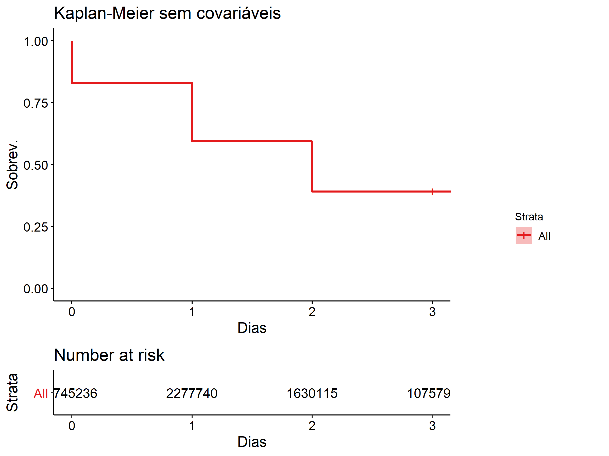
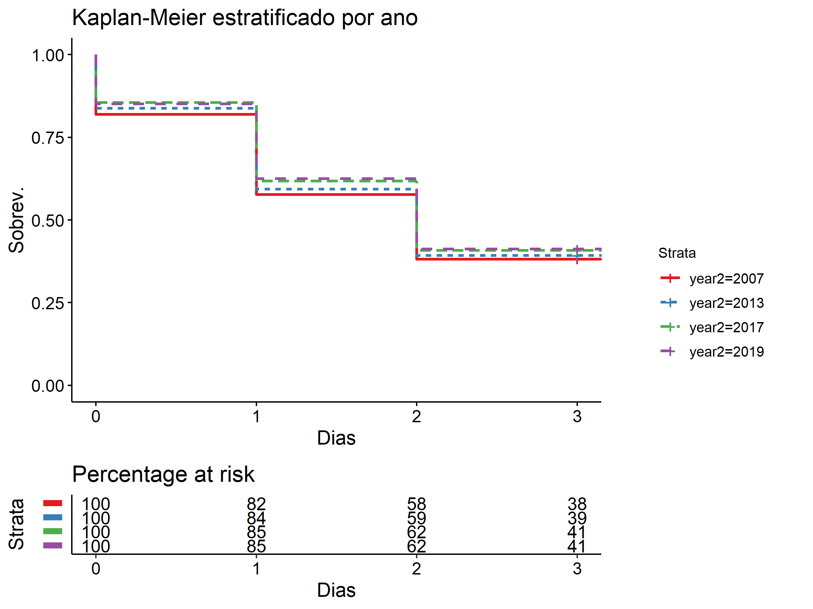
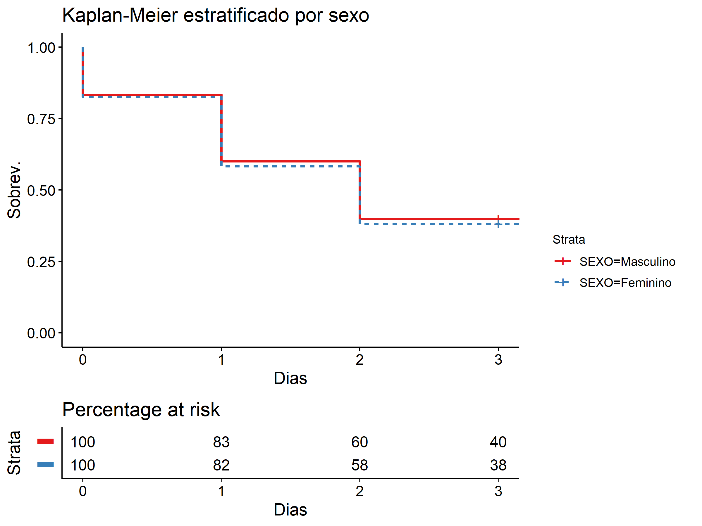
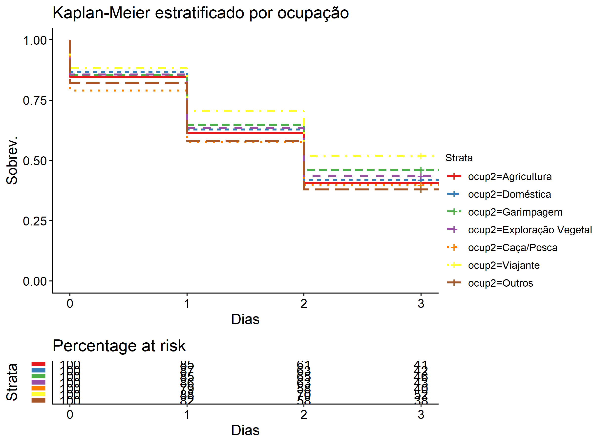
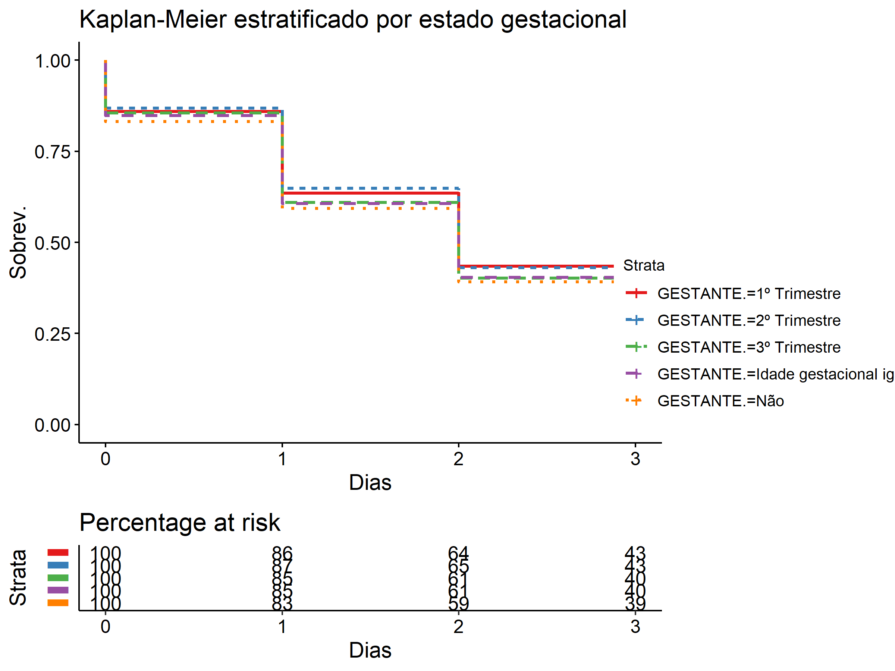
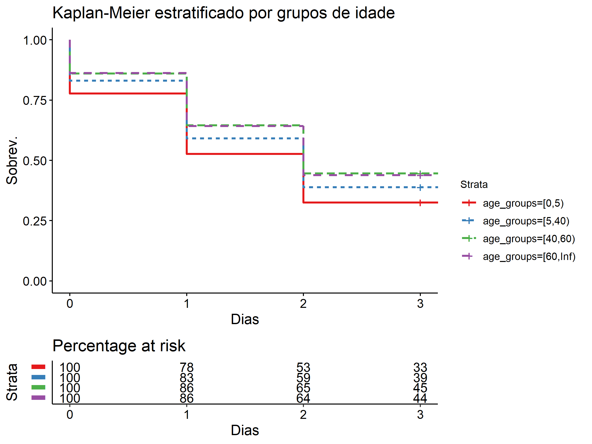
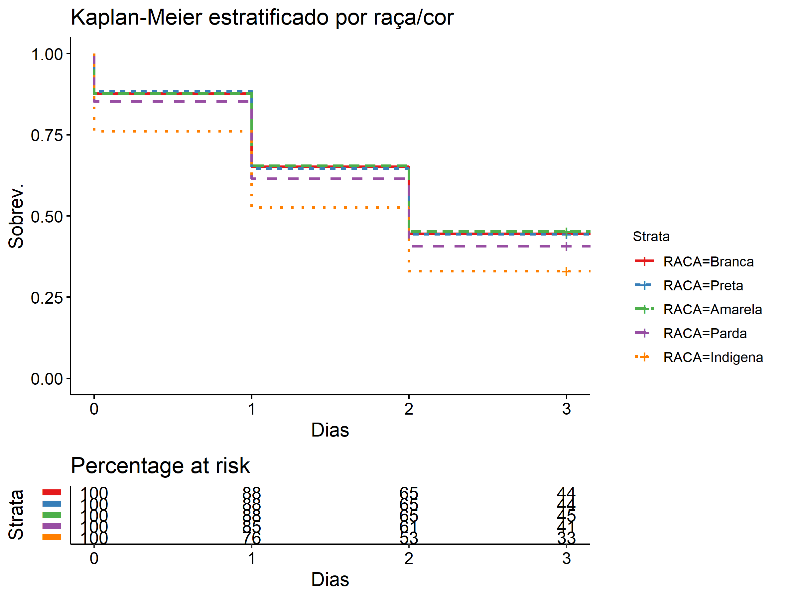
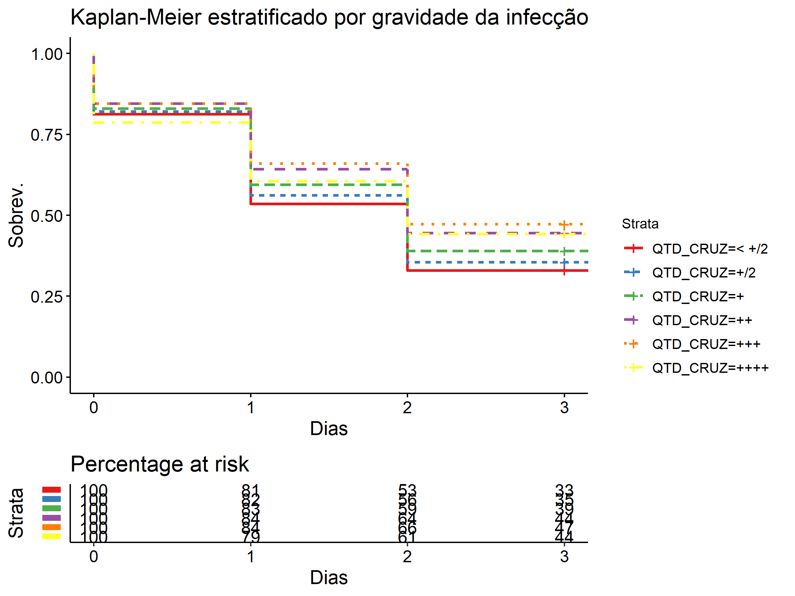
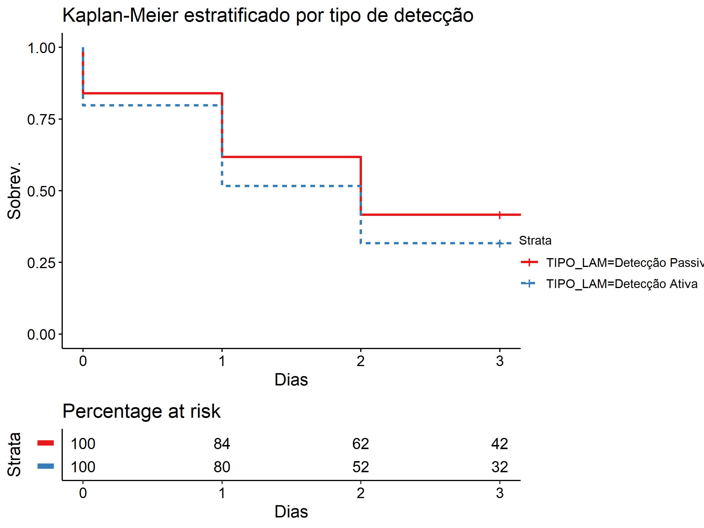
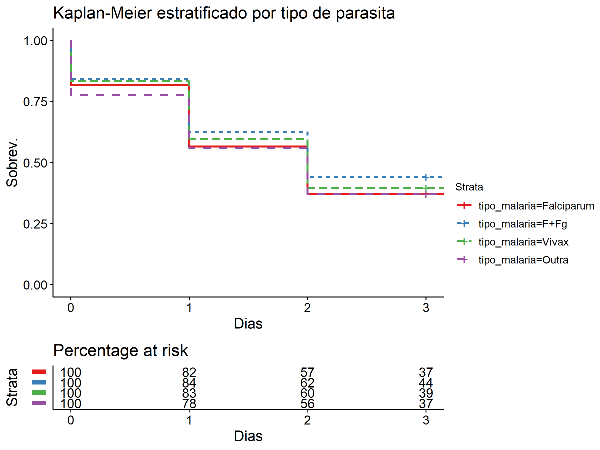

# Introdução

Uma das metas do programa de eliminação da malária é que os tratamentos se iniciem dentro de 48h. Guiado por esta iniciativa, conduziu-se uma análise de tempo até o evento considerando-se a "falha" o início do tratamento e a data de entrada no estudo a data dos sintomas. Os pacientes que não foram atendidos até 48h foram censurados.

## Descrição

<meta http-equiv="Content-Type" content="text/html; charset=utf-8" /> 

 
 SIVEP - Malária    19  Variables   2745236  Observations
 
 tempo hours 
 <table class="hmisctable559252">
 <tr><th>n</th><th>missing</th><th>distinct</th></tr>
 <tr><td>2745236</td><td>0</td><td>874</td></tr>
 </table>
 
 <table class="hmisctable432620">
 <tr><td>lowest :</td><td>      0 hours</td><td>     24 hours</td><td>     48 hours</td><td>     72 hours</td><td>     96 hours</td></tr>
 <tr><td>highest:</td><td>1753296 hours</td><td>1753320 hours</td><td>1753344 hours</td><td>1753368 hours</td><td>1753464 hours</td></tr>
 </table>
 
 trat48 
 <table class="hmisctable609373">
 <tr><th>n</th><th>missing</th><th>distinct</th><th>Info</th><th>Sum</th><th>Mean</th><th>Gmd</th></tr>
 <tr><td>2745236</td><td>0</td><td>2</td><td>0.715</td><td>1669442</td><td>0.6081</td><td>0.4766</td></tr>
 </table>
 
 age_groups

 
 <table class="hmisctable688375">
 <tr><th>n</th><th>missing</th><th>distinct</th></tr>
 <tr><td>2745236</td><td>0</td><td>4</td></tr>
 </table>
 <pre style="font-size:85%;">
 Value         [0,5)   [5,40)  [40,60) [60,Inf)
 Frequency    314563  1908641   420121   101911
 Proportion    0.115    0.695    0.153    0.037
 </pre>
 
 year

 
 <table class="hmisctable539998">
 <tr><th>n</th><th>missing</th><th>distinct</th><th>Info</th><th>Mean</th><th>Gmd</th><th>.05</th><th>.10</th><th>.25</th><th>.50</th><th>.75</th><th>.90</th><th>.95</th></tr>
 <tr><td>2745236</td><td>0</td><td>82</td><td>0.991</td><td>2012</td><td>4.364</td><td>2007</td><td>2007</td><td>2008</td><td>2011</td><td>2015</td><td>2018</td><td>2019</td></tr>
 </table>
 lowest : 2007 2008 2009 2010 2011 ,  highest: 2210 2211 2212 2213 2216 
 COD_OCUP

 
 <table class="hmisctable442108">
 <tr><th>n</th><th>missing</th><th>distinct</th></tr>
 <tr><td>2499508</td><td>245728</td><td>11</td></tr>
 </table>
 
 <table class="hmisctable237354">
 <tr><td>lowest :</td><td>Agricultura                     </td><td>Pecuária                        </td><td>Doméstica                       </td><td>Turismo                         </td><td>Garimpagem                      </td></tr>
 <tr><td>highest:</td><td>Caça/Pesca                      </td><td>Construção de estradas/barragens</td><td>Mineração                       </td><td>Viajante                        </td><td>Outros                          </td></tr>
 </table>
  Agricultura (625185, 0.250), Pecuária (14468, 0.006), Doméstica (275202, 0.110), Turismo (18169, 0.007), Garimpagem (109863, 0.044), Exploração Vegetal (39768, 0.016), Caça/Pesca (71330, 0.029), Construção de estradas/barragens (9449, 0.004), Mineração (4326, 0.002), Viajante (30756, 0.012), Outros (1300992, 0.520) 
 ESQUEMA

 
 <table class="hmisctable203949">
 <tr><th>n</th><th>missing</th><th>distinct</th></tr>
 <tr><td>2701562</td><td>43674</td><td>19</td></tr>
 </table>
 
 <table class="hmisctable206413">
 <tr><td>lowest :</td><td>Infecções pelo P. vivax, ou P. ovale com cloroquina em 3 dias e primaquina em 7 dias (esquema curto)                                             </td><td>Infecções pelo P. vivax, ou P. ovale com cloroquina em 3 dias e primaquina em 14 dias (esquema longo)                                            </td><td>Infecções pelo P. malariae para todas as idades e por P. vivax ou P. ovale em gestantes e crianças com menos de 6 meses, com cloroquina em 3 dias</td><td>Prevenção das recaídas frequentes por P. vivax ou P. ovale com cloroquina semanal em 12 semanas                                                  </td><td>Infecções por P. falciparum com a combinação fixa de artemeter+lumefantrina em 3 dias                                                            </td></tr>
 <tr><td>highest:</td><td>Infecções por Pf com Mefloquina em dose única e primaquina no segundo dia                                                                        </td><td>Infecções por Pf com Quinina em 7 dias                                                                                                           </td><td>Infecções por Pf de crianças com cápsulas retais de artesunato em 4 dias e dose única de Mefloquina no 3º dia e Primaquina no 5º ida             </td><td>Infecções mistas por Pv + Pf com Quinina em 3 dias, doxiciclina em 5 dias e Primaquina em 7 dias                                                 </td><td>Outro esquema utilizado (por médico)                                                                                                             </td></tr>
 </table>
 
 EXAME 
 <table class="hmisctable383246">
 <tr><th>n</th><th>missing</th><th>distinct</th></tr>
 <tr><td>1474432</td><td>1270804</td><td>2</td></tr>
 </table>
 <pre style="font-size:85%;">
 Value      Gota espessa/esfregaço           Teste rápido
 Frequency                 1425796                  48636
 Proportion                  0.967                  0.033
 </pre>
 
 FALCIPARUM 
 <table class="hmisctable795151">
 <tr><th>n</th><th>missing</th><th>distinct</th></tr>
 <tr><td>1474432</td><td>1270804</td><td>2</td></tr>
 </table>
 <pre style="font-size:85%;">
 Value          Sim     Não
 Frequency    13231 1461201
 Proportion   0.009   0.991
 </pre>
 
 GESTANTE.

 
 <table class="hmisctable369069">
 <tr><th>n</th><th>missing</th><th>distinct</th></tr>
 <tr><td>762968</td><td>1982268</td><td>5</td></tr>
 </table>
 
 <table class="hmisctable469341">
 <tr><td>lowest :</td><td>1º Trimestre              </td><td>2º Trimestre              </td><td>3º Trimestre              </td><td>Idade gestacional ignorada</td><td>Não                       </td></tr>
 <tr><td>highest:</td><td>1º Trimestre              </td><td>2º Trimestre              </td><td>3º Trimestre              </td><td>Idade gestacional ignorada</td><td>Não                       </td></tr>
 </table>
 <pre style="font-size:85%;">
 Value                    1º Trimestre               2º Trimestre
 Frequency                        5443                       6978
 Proportion                      0.007                      0.009
                                                                 
 Value                    3º Trimestre Idade gestacional ignorada
 Frequency                        6465                      20963
 Proportion                      0.008                      0.027
                                      
 Value                             Não
 Frequency                      723119
 Proportion                      0.948
 </pre>
 
 HEMOPARASI

 
 <table class="hmisctable190795">
 <tr><th>n</th><th>missing</th><th>distinct</th></tr>
 <tr><td>1474432</td><td>1270804</td><td>5</td></tr>
 </table>
 
 <table class="hmisctable948414">
 <tr><td>lowest :</td><td>Negativo                     </td><td>Trypanosoma sp.              </td><td>Microfilária                 </td><td>Trypanosoma sp.+ Microfilária</td><td>Não pesquisados              </td></tr>
 <tr><td>highest:</td><td>Negativo                     </td><td>Trypanosoma sp.              </td><td>Microfilária                 </td><td>Trypanosoma sp.+ Microfilária</td><td>Não pesquisados              </td></tr>
 </table>
  Negativo (863944, 0.586), Trypanosoma sp. (1594, 0.001), Microfilária (3886, 0.003), Trypanosoma sp.+ Microfilária (1339, 0.001), Não pesquisados (603669, 0.409) 
 ID_LVC 
 <table class="hmisctable527488">
 <tr><th>n</th><th>missing</th><th>distinct</th><th>value</th></tr>
 <tr><td>2745236</td><td>0</td><td>1</td><td>Não LVC</td></tr>
 </table>
 <pre style="font-size:85%;">
 Value      Não LVC
 Frequency  2745236
 Proportion       1
 </pre>
 
 ID_PACIE

 
 <table class="hmisctable717076">
 <tr><th>n</th><th>missing</th><th>distinct</th><th>Info</th><th>Mean</th><th>Gmd</th><th>.05</th><th>.10</th><th>.25</th><th>.50</th><th>.75</th><th>.90</th><th>.95</th></tr>
 <tr><td>2745236</td><td>0</td><td>106</td><td>1</td><td>24</td><td>19.15</td><td> 2</td><td> 4</td><td>10</td><td>21</td><td>35</td><td>49</td><td>56</td></tr>
 </table>
 lowest :   0   1   2   3   4 ,  highest: 101 102 103 104 105 
 NIV_ESCO

 
 <table class="hmisctable141926">
 <tr><th>n</th><th>missing</th><th>distinct</th></tr>
 <tr><td>2421896</td><td>323340</td><td>9</td></tr>
 </table>
 
 <table class="hmisctable177715">
 <tr><td>lowest :</td><td>Analfabeto                    </td><td>1ª a 4ª série incompleta do EF</td><td>4ª série completa do EF       </td><td>5ª a 8ª série incompleta do EF</td><td>Ensino fundamental completo   </td></tr>
 <tr><td>highest:</td><td>Ensino fundamental completo   </td><td>Ensino médio incompleto       </td><td>Ensino médio completo         </td><td>Educação superior incompleto  </td><td>Educação superior completa    </td></tr>
 </table>
 
 QTD_CRUZ

 
 <table class="hmisctable745697">
 <tr><th>n</th><th>missing</th><th>distinct</th></tr>
 <tr><td>2745236</td><td>0</td><td>6</td></tr>
 </table>
 lowest : < +/2 +/2   +     ++    +++   ,  highest: +/2   +     ++    +++   ++++  <pre style="font-size:85%;">
 Value        < +/2     +/2       +      ++     +++    ++++
 Frequency   699109  391283  559879 1021865   70269    2831
 Proportion   0.255   0.143   0.204   0.372   0.026   0.001
 </pre>
 
 RACA

 
 <table class="hmisctable765867">
 <tr><th>n</th><th>missing</th><th>distinct</th></tr>
 <tr><td>1474432</td><td>1270804</td><td>5</td></tr>
 </table>
 lowest : Branca   Preta    Amarela  Parda    Indigena ,  highest: Branca   Preta    Amarela  Parda    Indigena <pre style="font-size:85%;">
 Value        Branca    Preta  Amarela    Parda Indigena
 Frequency     94753    58497    13099  1075563   232520
 Proportion    0.064    0.040    0.009    0.729    0.158
 </pre>
 
 RES_EXAM

 
 <table class="hmisctable740986">
 <tr><th>n</th><th>missing</th><th>distinct</th></tr>
 <tr><td>2745236</td><td>0</td><td>10</td></tr>
 </table>
 
 <table class="hmisctable758479">
 <tr><td>lowest :</td><td>Falciparum    </td><td>F+Fg          </td><td>Vivax         </td><td>F+V           </td><td>V+Fg          </td></tr>
 <tr><td>highest:</td><td>Fg            </td><td>Malariae      </td><td>F+M           </td><td>Ovale         </td><td>Não Falciparum</td></tr>
 </table>
 <pre style="font-size:85%;">
 Value          Falciparum           F+Fg          Vivax            F+V
 Frequency          310554          46401        2335671          17403
 Proportion          0.113          0.017          0.851          0.006
                                                                       
 Value                V+Fg             Fg       Malariae            F+M
 Frequency            7251           9192            740            373
 Proportion          0.003          0.003          0.000          0.000
                                         
 Value               Ovale Não Falciparum
 Frequency              10          17641
 Proportion          0.000          0.006
 </pre>
 
 SEXO 
 <table class="hmisctable339760">
 <tr><th>n</th><th>missing</th><th>distinct</th></tr>
 <tr><td>2744987</td><td>249</td><td>2</td></tr>
 </table>
 <pre style="font-size:85%;">
 Value      Masculino  Feminino
 Frequency    1678228   1066759
 Proportion     0.611     0.389
 </pre>
 
 TIPO_LAM 
 <table class="hmisctable642640">
 <tr><th>n</th><th>missing</th><th>distinct</th></tr>
 <tr><td>2745236</td><td>0</td><td>2</td></tr>
 </table>
 <pre style="font-size:85%;">
 Value      Detecção Passiva   Detecção Ativa
 Frequency           2085766           659470
 Proportion             0.76             0.24
 </pre>
 
 VIVAX 
 <table class="hmisctable439648">
 <tr><th>n</th><th>missing</th><th>distinct</th></tr>
 <tr><td>1474432</td><td>1270804</td><td>2</td></tr>
 </table>
 <pre style="font-size:85%;">
 Value          Sim     Não
 Frequency    18227 1456205
 Proportion   0.012   0.988
 </pre>
 

Utilizamos apenas as notificações primárias de malária, descartando as lâminas de verificação de cura. Partimos do princípio que as lâminas referem-se a um momento distinto do tratamento e, portanto, devem ter uma análise própria. A questão central, nos parece, é a responsividade do sistema de saúde para atender pacientes que contraem malária, como estratégia para diminuir a mortalidade, a morbidade e prevenir a disseminação da doença.

Foram analisados 2745236 casos entre 2007-2019, cujas contagens e proporções podem ser vistos nas tabelas acima. É importante lembrar que a presença de valores desconhecidos ("NA") não se refere apenas a ausência de informações, parte destes valores decorre de alterações no formulário de notificação, e parte decorre do fluxo de resposta do questionário (ver [Arruda][1] e [Folder][2]).

[1]: <!-- Inserir link -->
[2]: <!-- Inserir link -->

# Variáveis

Destacamos aqui algumas variáveis para a análise que acreditamos terem maior importância do ponto de vista clínico, dado o contexto social e ambiental no qual ocorre a disseminação da malária.

- age_groups: separamos alguns grupos etários considerando os riscos de transmissão e a gravidade da doença.
- COD_OCUP: as ocupações dos indivíduos são recorrentemente citadas na literatura como fator de risco importante.
- ESQUEMA: esta variável codifica não apenas o tratamento prescrito, mas contém informações sobre a gravidade da infecção.
- GESTANTE: esta variável é também citada como um fator de risco e é objeto de diversas ações de controle e prevenção.
- NIV_ESCO: embora não seja frequentemente citada como fator de risco, geralmente é uma *proxy* da condição socioeconômica dos indivíduos e do seu conhecimento sobre medidas de prevenção e saúde em geral.
- QTD_CRUZ: contagem de parasitos no sangue, indica a gravidade da infecção.
- RACA: outra variável que indica *proxy* de questões socioeconômicas e de acesso a serviços de saúde.
- RES_EXAM: variável importante para discriminar o tipo de malária contraído.
- SEXO: variável frequentemente relevante nos estudos clínicos pois há diferenças importantes na sobrevivência de homens e mulheres.
- TIPO_LAM: variável importante no planejamento de ações, pois discrimina entre detecção ativa e passiva.

# Metodologia

Foram construídas estimativas não-paramétricas de sobrevivência pelo método de Kaplan-Meier estratificado pelas variáveis de interesse. As diferenças entre as curvas foram validadas por testes log-rank. Também tentou-se a aplicação de modelos paramétricos e semiparamétricos de sobrevivência, mas os resultados foram pouco satisfatórios (concordância máxima do modelo de Cox com múltiplas variáveis de 0.58, R² < 0.05).

É importante considerar limitações dos dados e dos testes. Os dados referem-se apenas a subpopulação de pessoas testadas positivo para malária no sistema de vigilância, é possível que isto introduza vieses em diversos níveis, desde a subnotificação, subdiagnóstico até o acesso ao serviço. Os dados aqui não estão sendo comparados a população em geral. Os testes, por sua vez, foram pensados para obter bom poder estatístico em amostras pequenas de estudos clínicos com algumas dezenas ou centenas de pacientes. Com uma amostra de 2,7 milhões de pessoas, até mesmo pequenas diferenças podem ser consideradas estatisticamente significativas embora não resultem em diferenças clinicamente significativas ou em *actionable intelligence*, ou seja, em resultados que possam ser traduzidos em intervenções.

# Resultados

Inicialmente, ajustamente uma estimativa de Kaplan-Meier para o conjunto dos dados

O resultado mostra que mais de 60% das pessoas são atendidas dentro das primeiras 48h, mas a proporção de pessoas que são atendidas mais tarde é ainda muito grande e isto já é tratado pelos gestores do programa como prioridade para os próximos 15 anos.

# Evolução temporal

Uma das preocupações expressas nos objetivos do Plano Nacional de Controle e Eliminação é com a diminuição do tempo de resposta, para que o número de pessoas tratadas dentro de 48h do início dos sintomas seja o maior possível. O documento "Avaliação do Programa Nacional de Controle de Malária" (FIOCRUZ, Dezembro 2019) até aponta uma melhora neste indicador, porém, não é o que mostra a curva de Kaplan-Meier estratificado por anos selecionados:

As curvas mostram que a proporção de pessoas que iniciam o tratamento até as 48h está menor do que em 2007 e que esta piora é consistente ao longo dos anos. Conjetura-se que esta piora pode ser o resultado da própria eficácia do programa, que conseguiu eliminar ou reduzir significativamente a incidência em localidades onde ocorria grande concentração de casos e agora estamos detectando casos em locais remotos, potencialmente de difícil acesso, ou numa população que tem mais dificuldade em acessar o serviço de saúde.

Os resultados do teste log rank encontram-se abaixo:

|     Test|     Chisq| df| p.value|
|--------:|---------:|--:|-------:|
|Log-rank |  1140.606|  3|> 0.0001|

# Sexo

A divisão por sexo é uma análise comum em estudos clínicos, dadas as conhecidas diferenças na sobrevivência entre homens e mulheres:

Existe uma ligeira, mas estatisticamente significativa diferença entre homens e mulheres, possívelmente devido a uma questão comportamental em relação a saúde. É possível que os resultados decorram das mulheres buscarem o atendimento mais cedo que os homens e, portanto, iniciarem o seu tratamento relativamente mais cedo, as diferenças são bastante sutis, no entanto. Os resultados do teste log-rank encontram-se abaixo.

|     Test|     Chisq| df| p.value|
|--------:|---------:|--:|-------:|
|Log-rank |  984.9565|  1|> 0.0001|

# Ocupação

Também na avaliação do programa, encontram-se entre os fatores que requerem atenção e intervenção algumas profissões que se encontram sob maior risco de contrair malária. O documento menciona explicitamente garimpeiros e viajantes, os primeiros porque combinam alta mobilidade, habitações improvisadas e em áreas propícias a reprodução do vetor, dificuldade de acompanhamento e tratamento no caso da confirmação dos casos, os últimos porque sua alta mobilidade ocasionada pelo trabalho apresenta não só um risco maior de infecção, mas também de disseminação e reintrodução de malária onde ela já havia sido eliminada.

Logo de cara, um dos problemas com a categoria "Ocupação", é que a categoria outros abarca 1.3 milhão de casos de um total de 2.5 milhões de casos válidos, além de ter 250.000 valores desconhecidos. Estes valores desconhecidos estão concentrados até 2010, quando começam a desaparecer, a partir de 2013, o número de valores desconhecidos é residual. A categoria outros, por sua vez, frequentemente corresponde a mais de 50% dos casos em um ano.

O gráfico mostra que viajantes são, de fato, menos atendidos em 48h que outras ocupações, seguidos por pacientes envolvidos com garimpo, o que confirma a preocupação que estas duas categorias geram. Este resultado pode estar ainda associado a dispersão espacial da malária através de vários municípios próximos, pois estas populações altamente móveis podem funcionar como disseminadores <!-- citar Igor -->. Outra população que merece atenção é aquela ocupada na exploração vegetal, pois tende a estar exposta a maior contato com o vetor e o dado revela que também demora mais para iniciar o tratamento.

Ressalta-se que as diferenças nas curvas são estatisticamente significativas segundo o teste log-rank apresentado abaixo e que as diferenças percentuais entre os grupos são bastante relevantes, o grupo de "Viajantes" chega ao terceiro dia com 52% não tratados, contra apenas 38% dos "Outros".

<!-- Ponha a tabela do log-rank aqui -->
|     Test|     Chisq| df| p.value|
|--------:|---------:|--:|-------:|
|Log-rank |  7804.039|  6|> 0.0001|

# Estado gestacional

Outra preocupação do programa é com as infecções durante a gravidez e em crianças menos de 5 anos, pois são pacientes especialmente vulneráveis a formas mais graves da doença e à mortalidade por malária. A seguir apresenta-se curvas para estado gestacional.

As curvas mostram um resultado negativo, no sentido de que pacientes não-gestantes estão iniciando o tratamento em 48h em proporção maior que gestantes em todos os períodos, particularmente nos dois primeiros trimestres de gestação. A diferença de 4% entre as gestantes de 1º e 2º trimestre em relação a 39% dos não-gestantes. Importante ressaltar que não-gestantes inclui, também, homens. Os resultados do log-rank encontram-se abaixo.

|     Test|     Chisq| df| p.value|
|--------:|---------:|--:|-------:|
|Log-rank |  144.9113|  4|> 0.0001|

# Idade

Como citado na seção anterior, existe uma preocupação especial com as infecções nas populações cuja saúde é mais frágil, as crianças menores de 5 anos e os idosos, portanto, apresentamos curvas para grupos etários.

As curvas mostram que as crianças menores de 5 anos tem, de fato, começado seus tratamentos em 48h em maior proporção que outros grupos (33% contra 39% e 45% de jovens e adultos), já os idosos tem proporções similares aos adultos (44 e 45% respectivamente). O teste log-rank encontra-se abaixo.

|     Test|     Chisq| df| p.value|
|--------:|---------:|--:|-------:|
|Log-rank |  15312.32|  3|> 0.0001|

# Raça/Cor

A estratificação por raça/cor é relevante pois historicamente a população negra (Preta + Parda) e a população indígena sofreram discriminação no acesso e na qualidade do atendimento, o que resulta em desfechos de saúde piores que a população branca. Abaixo apresentamos curvas estratificando por raça/cor.

No caso do início do tratamento, temos uma situação *sui generis*, pois a população indígena tem uma proporção muito maior de tratamentos iniciados em 48h e a população parda tem uma proporção maior que as populações preta, branca e amarela. A diferença entre índigenas e brancos é de 11%, e de pardos para brancos, de 4%. É possível que as diferenças maiores observadas na população indígena decorram do bom funcionamento do sistema de distritos de saúde indígena (DSEI), apesar das limitações deste sistema apresentadas na avaliação do programa. A significância estatística dos testes pode ser verificada abaixo.

|     Test|     Chisq| df| p.value|
|--------:|---------:|--:|-------:|
|Log-rank |  10397.51|  4|> 0.0001|

# Gravidade da infecção

A gravidade da infecção é medida pela quantidade de parasitas no sangue, aqui representadas esquematicamente por "cruzes", quanto maior o número de cruzes, mais grave a doença. 

Na curva apresentada abaixo, podemos ver a urgência do início do tratamento, pois a medida que nos afastamos do início dos sintomas, percebemos que o número de cruzes aumenta, em outras palavras, a demora no início do tratamento preconiza uma infecção mais grave, mais perigosa e mais difícil de tratar. A diferença entre a população com menos de meia cruz tratada em 48h e a população com 3 cruzes tratada em 48h é de 14%. Os resultados do teste log-rank encontram-se abaixo.

|     Test|     Chisq| df| p.value|
|--------:|---------:|--:|-------:|
|Log-rank |  28935.58|  5|> 0.0001|

# Forma de detecção da malária

Uma última variável que procuramos investigar foi a relação entre início do tratamento a detecção ativa da malária. É uma variável relevante pois a natureza ecológica e espacial do vetor de transmissão da doença exige que a vigilância atue na busca ativa por pacientes infectados em uma área uma vez que um novo caso foi detectado. Em uma situação ideal, deveríamos observar um pequeno número de casos detectados passivamente que dão origem a uma investigação ativa e a detecção precoce de novos casos. Pensando nisso, estratificamos as curvas por tipo de detecção.

As diferenças entre a detecção e passiva são visíveis no início do tratamento, com cerca de 10% de diferença na proporção de tratamentos iniciados dentro de 48h do aparecimento de sintomas. Isto valida a preocupação expressa na avaliação do programa do estímulo a detecção ativa de casos, pois é uma forma de aumentar a eficácia de outros aspectos do combate a malária. Abaixo encontra-se o resultado do teste log-rank.

|     Test|     Chisq| df| p.value|
|--------:|---------:|--:|-------:|
|Log-rank |  24841.65|  1|> 0.0001|

# Tipo de parasita

Outro objetivo importante do atual estágio do combate a malária no Brasil é a eliminação do *plasmodium Falciparum* até 2030. Este é responsável pelas formas mais graves e letais de malária no país e bastante progresso foi alcançado nas últimas duas décadas na redução da sua incidência e eliminação em algumas áreas. Apresentamos agora curvas por tipo de *plasmodium*.

As curvas mostram que o início de tratamentos em pacientes com o *Falciparum* é melhor que no caso do *Vivax*, porém, também há uma proporção maior (44%) de pacientes um estágio mais avançado da infecção do *Falciparum*, no qual os gametócitos já estão presentes no sangue, que indica que a detecção da malária já aconteceu num estado bastante tardio. As diferenças entre os infectados com Vivax e Falciparum são de apenas 2%. O teste log-rank está abaixo:

|     Test|     Chisq| df| p.value|
|--------:|---------:|--:|-------:|
|Log-rank |      1660|  3|> 0.0001|

Existem também outros tipos de infecção por malária no SIVEP, mas aqui nos concentramos nas 3 mais frequentes (98.8% do total) e agrupamos todas as outras na categoria "Outra" (1.2%).

## Sumário da análise de sobrevivência

O nível geral de início do tratamento em 48h nos parece insatisfatório para os objetivos do programa, cerca de 40% de todos os pacientes não iniciam seus tratamentos no tempo preconizado, o que resulta em infecções mais graves e aumenta o risco de transmissão para outros pacientes ao aumentar o tempo de exposição do infectado ao mosquito. O avanço no controle e eventual eliminação da malária provavelmente demandará uma redução deste nível global. Outra área que merece atenção é a malária Falciparum, considerando o objetivo do programa de eliminação desta forma da doença até 2030, provavelmente é necessário um esforço de melhorar a detecção e início do tratamento desta forma específica de malária, algo que deve ser possível através de esforços focados nas regiões onde o parasita ainda é endêmico.

Quanto as características dos pacientes, percebemos que alguns objetivos do programa estão sendo cumpridos: a população indígena e as crianças menores de 5 anos tem indicadores significativamente melhores de início do tratamento que a média. Porém, em outros indicadores, como os tratamentos em gestantes e na melhora do indicador ao longo do período analisado (2007-2019), percebemos que há espaço para melhorar. Por fim, considerando as ocupações dos pacientes, além da mobilidade de garimpeiros e viajantes, é importante acompanhar pacientes que trabalham com exploração vegetal e que exista um esforço para a diminuição da quantidade de formulários preenchidos como "Outras" ocupações, já que esta é uma potencial fonte importante de informação sobre o risco de contrair malária.
